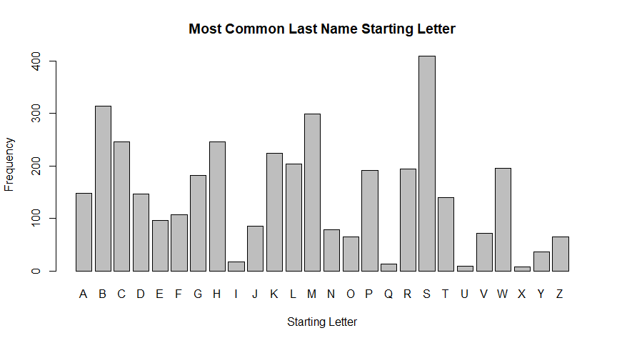

Homework 1
================
Jake Fenley
9/16/2021

# How to Submit

1)  output as github\_document and push to github Then output as
    html\_document and upload html\_doc to canvas
2)  Include link to github in your html document

## [Link to Github](https://github.com/jpFenley/stat433-hw1)

### Import necessary libraries

``` r
library(rvest)
library(stringr)
library(plyr)
library(kableExtra)
```

### Read in HTML

We can read in the HTMl from the website and create a data frame to hold
the information.

``` r
html <- read_html("https://guide.wisc.edu/faculty/")
people <- html_nodes(html, '.uw-people')
faculty = data.frame(Name=character(),
                     Title = character(),
                     Area=character(),
                     School = character(),
                     stringsAsFactors = FALSE)
```

### Parse Data

We begin by iterating through all the letters of the alphabet. We remove
unnecessary HTML at the beginning and end of each table. Then we can
split the information by each person. For each person, we split the data
by break symbols to obtain all of the fields. We update the table each
time.

``` r
for (letter in people) {
  letter <- as.character(letter)
  letter <- str_replace(letter, "<ul class=\"uw-people\">\n<li><p>", "")
  letter <- str_replace(letter, "<br></p></li>\n</ul>\n", "")
  letter <- str_replace(letter, "<br></p></li>\n</ul>", "")
  names <- unlist(strsplit(letter, "<br></p></li>\\n<li><p>"))
  for (p in names){
    faculty <- rbind(faculty, unlist(strsplit(p, "<br>")))
  }
}
names(faculty) <- c("Name", "Title", "Area", "Degree")
```

### Checking Data

We will print the first couple rows of the table.

``` r
head(faculty)
```

    ##                   Name                 Title                        Area
    ## 1      ABBOTT,DAVID H.             Professor Obstetrics &amp; Gynecology
    ## 2   ABD-ELSAYED,ALAA A Assoc Professor (Chs)              Anesthesiology
    ## 3     ABDUALLAH,FAISAL             Professor                         Art
    ## 4 ABRAHAM,OLUFUNMILOLA   Assistant Professor                    Pharmacy
    ## 5      ABRAMS,SAMANTHA        Assoc Lecturer          Information School
    ## 6         ABRAMSON,LYN             Professor                  Psychology
    ##                                Degree
    ## 1    PHD 1979 University of Edinburgh
    ## 2        MD 2000 University of Assiut
    ## 3       PHD 2012 Royal College of Art
    ## 4  PHD 2013 Univ of Wisconsin-Madison
    ## 5   MA 2017 Univ of Wisconsin-Madison
    ## 6 PHD 1978 University of Pennsylvania

### Creating a Plot

We wish to plot the count of how many last names start with each letter.
We assign a new column to the data frame with this letter. We then count
how many each one appears, and plot is as a bar plot.

``` r
faculty$Starts <- str_sub(faculty$Name, 1, 1)
```

``` r
cnts <- table(faculty$Starts)
barplot(cnts, main="Most Common Last Name Starting Letter",
        xlab = "Starting Letter",
        ylab = "Frequency")
```

<!-- -->
